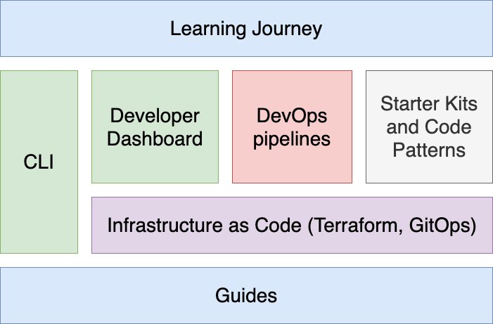
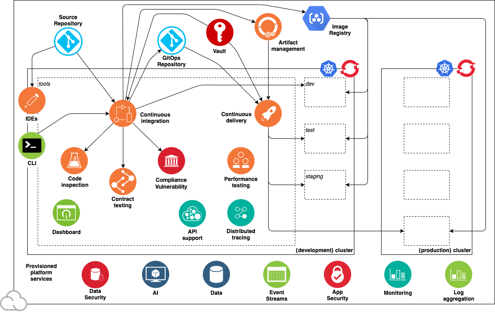
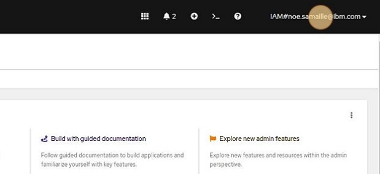
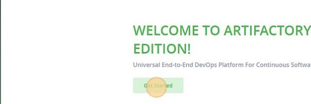
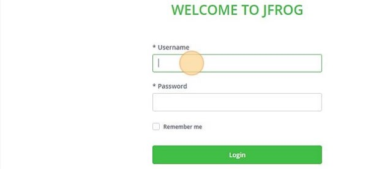
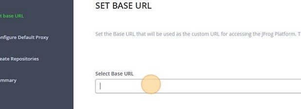
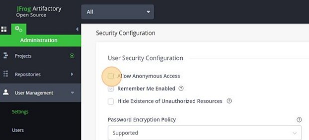
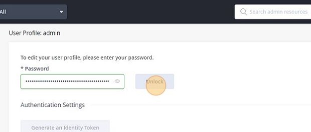
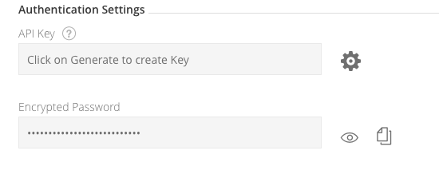
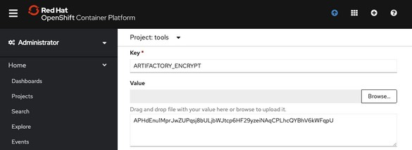

# Cloud-Native Toolkit - GitOps Install

## Overview

[Cloud-Native Toolkit](https://cloudnativetoolkit.dev) is an open-source collection of assets that provide an environment for developing cloud-native applications for deployment within Red Hat OpenShift. It embodies IBM Garage Method principles and practices for consistently developed applications, incorporating best practices that increase developer velocity for efficient delivery of business value.

### Components

As the name suggests, the Cloud-Native Toolkit provides a collection of tools that can be used in part or in whole to support the activities of software development life-cycle. The following provides a listing of the assets that make up the Cloud-Native Toolkit:



### Environment components

After installation, the environment consists of the following components and developer tools:

- A Red Hat OpenShift Service development cluster
- A collection of continuous delivery tools deployed into the cluster
- A set of backend services

This diagram illustrates the environment:



The diagram shows the components in the environment: the cluster, the deployment target environments, the cloud services, and the tools.

The following best-of-breed open source software tools are installed in the cluster's *tools* namespace:

| Capability                  | Tool           |Description |
| --------------------------- |:-------------- |------------|
| Continuous Integration | [Tekton CI](https://tekton.dev/) | Tekton is an emerging tool for Continuous Integration with Kubernetes and OpenShift  |
| API Contract Testing | [Pact](https://docs.pact.io/pact_broker) | Pact enables API contract testing |
| Code Analysis | [SonarQube](https://docs.sonarqube.org/latest/) | SonarQube can scan code and display the results in a dashboard |
| Container Image Registry | [Container Registry](https://cloud.ibm.com/docs/Registry?topic=Registry-getting-started) | Stores container images to be deployed |
| Artifact Management | [Artifactory](https://jfrog.com/artifactory/) | Artifactory is an artifact storage and Helm chart repository  |
| Continuous Delivery | [ArgoCD](https://argoproj.github.io/cd/) | ArgoCD support Continuous Delivery with GitOps |
| Web IDE | [Code Ready Workspace](https://developers.redhat.com/products/codeready-workspaces/overview) | IDE for editing and managing code in a web browser |

## Install the Toolkit

### Prerequisites

- OpenShift Cluster available with admin access
- `docker` CLI available on your workstation
- [GitHub](https://github.com/) user

### On OpenShift Console

1. On the OpenShift console, click "Copy login command" on the top right corner:

    

2. Click "Display Token":

    

3. Copy the `token` and `server` URL available in the provided `oc login` command

### On your workstation

1. Create a `cntk` directory:
    ```sh
    mkdir cntk
    cd cntk
    ```
2. Install `iascable` CLI:
    ```sh
    curl -sL https://iascable.cloudnativetoolkit.dev/install.sh | sh
    ```
3. Get OpenShift GitOps and Developer Tools Bills of Materials:
    ```sh
    curl -sL https://github.com/cloud-native-toolkit/automation-solutions/releases/download/200-openshift-gitops_v1.0.1/bom.yaml > 200-openshift-gitops.yaml
    curl -sL https://github.com/cloud-native-toolkit/automation-solutions/releases/download/220-dev-tools_v1.0.0/bom.yaml > 220-dev-tools.yaml
    ```
4. Build both BOMs using `iascable`:
    ```sh
    iascable build -i 200-openshift-gitops.yaml
    iascable build -i 220-dev-tools.yaml
    ```
5. Navigate to `output` directory and open a helper docker container that contains `terraform` CLI required to run the automation:
    ```sh
    cd output
    ./launch.sh
    ```
6. In your docker container, create the required environment variables required to run the terraform automation on your OpenShift cluster:
    ```sh
    export TF_VAR_config_banner_text="Cloud-Native Toolkit"
    export TF_VAR_gitops_repo_repo=<GITOPS_REPOSITORY>
    export TF_VAR_server_url=<OPENSHIFT_SERVER_URL>
    export TF_VAR_cluster_login_token=<OPENSHIFT_SERVER_TOKEN>
    ```

    ??? info "Help"
        - `TF_VAR_server_url` is the OpenShift server URL you retrieved in the [first step](#on-openshift-console)
        - `TF_VAR_cluster_login_token` is the OpenShift login token you retrieved in the [first step](#on-openshift-console)

7. Navigate to `200-openshift-gitops` terraform module and run the automation:
    ```sh
    cd 200-openshift-gitops/terraform/
    terraform init
    terraform apply --auto-approve
    ```

    !!! info "NOTE"
        By default, when not providing a `gitops_repo_host` terraform variable, a [Gitea](https://gitea.io/en-us/) instance is being deployed in the cluster to host the GitOps repository, to install the developer tools we'll need to retrieve the provisioned Gitea host, username and token.

8. We'll now need to login to the OpenShift cluster using the `oc login` command from [first step](#on-openshift-console) to retrieve Gitea credentials to pass to next terraform module:
    ```sh
    oc login --token=${LOGIN_TOKEN} --server=${SERVER_URL}
    ```
9.  Navigate to `220-dev-tools` terraform module and run the automation:
    ```sh
    cd ../../220-dev-tools/terraform
    export TF_VAR_gitops_repo_gitea_host=$(oc get route -n gitea gitea -o yaml | yq .spec.host)
    export TF_VAR_gitops_repo_gitea_username=$(oc get secret -n gitea gitea-access -o yaml | yq .data.username | base64 -d)
    export TF_VAR_gitops_repo_gitea_token=$(oc get secret -n gitea gitea-access -o yaml | yq .data.password | base64 -d)
    terraform init
    terraform apply --auto-approve
    ```

### Artifactory initial setup

1. Navigate to OpenShift console.
2. Click this icon
   
    

3. Click "Artifactory"
   
    

4. Log in using default username `admin` and password `password`.
5. Click "Get Started".
   
    

6. Reset password following Artifactory requirements, and save it somewhere safe (e.g. 1Password password manager). Then click "Next".
   
    

7. Paste the URL into the Select Base URL form and remove any trailing context roots, similar to the one in this view.
   
    

8. The next page in the wizard is the Configure a Proxy Server page. This is to setup a proxy for external resources. You can click Next to skip this step.
9. The next page in the wizard is the Create Repositories page. Select "Generic", then press "Next".
10. The next page in the wizard is the Onboarding Complete page. Press "Finish".
11. Allow Anonymous Access to Artifactory: Click on the Settings tab on the left menu (the one with the gear icon), and then select Security
   
    

12. Obtain the encrypted password: In the Artifactory console, press the "Welcome, admin" menu button in the top right corner of the console and select "Edit profile"
   
    

13. In the User Profile: admin page, enter you Artifactory password and press **Unlock**:

    

14. Below, in the **Authentication Settings** section, is the **Encrypted Password** field Press the **Eye** icon to view the encrypted password and press the **Cut & Paste** icon to copy it:

    

15.  In the OpenShift 4 console, go to **Administrator > Workloads > Secrets**. At the top, select the tools project and filter for **artifactory**. Select **Edit Secret** on **artifactory-access**. Add a key/value for `ARTIFACTORY_ENCRYPT` and set the value to your encrypt key value:

    

### Sonarqube initial setup


1. Navigate to OpenShift console.
2. Click this icon
   
    

3. Click "Sonarqube"
4. Log in using default username `admin` and password `admin`. 
5. Reset the default admin password by putting a custom one, save it for next step.
6. Create the `sonarqube-access` secret in OpenShift `tools` namespace with your newly created admin password:
    ```sh
    oc create secret generic sonarqube-access -n tools --from-literal=SONARQUBE_USER=admin --from-literal=SONARQUBE_PASSWORD=${SONARQUBE_PASSWORD}
    ```
